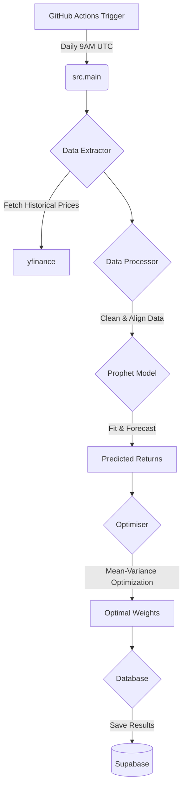

# Project Analysis: Prophet Forecasting for Portfolio Optimisation

## 1. Project Goal
The project aims to automate the process of periodic portfolio rebalancing. It does this by:
1.  **Forecasting** the next day's stock prices for a selected list of assets (tickers).
2.  **Optimizing** the portfolio allocation (weights) based on these forecasts to maximize risk-adjusted returns.
3.  **Storing** the results for visualization (e.g., on a Streamlit dashboard).

## 2. Architecture & Workflow
The system runs as a pipeline, automated daily via GitHub Actions.

## 3. Key Components

### A. Data Extraction (`src/extractor.py`)
-   **Library**: `yfinance`
-   **Function**: Fetches historical stock data (Close prices) for a defined list of tickers (e.g., AAPL, MSFT, AMD).
-   **Features**: It handles missing data and calculates daily returns.

### B. Time Series Forecasting (`src/model.py`)
-   **Model**: **Facebook Prophet** (`prophet` library).
-   **Logic**:
    -   Fits a model for *each* ticker individually.
    -   **Holiday Aware**: It specifically incorporates US trading holidays (`pandas_market_calendars`) to improve accuracy around market closures.
    -   **Prediction**: Generates a 1-day ahead forecast for price.
    -   Derives **Predicted Return**: `(Forecast Price - Current Price) / Current Price`.

### C. Portfolio Optimization (`src/optimiser.py`)
-   **Method**: **Markowitz Mean-Variance Optimization**.
-   **Objective**: Maximize `Portfolio Return - (Risk Aversion * Portfolio Variance)`.
    -   *Portfolio Return*: Dot product of Weights and Predicted Returns.
    -   *Portfolio Variance*: Risk measured by the covariance matrix of historical returns (last 252 days).
-   **Constraints**:
    -   All weights must sum to 1 (100% allocation).
    -   **Minimum Allocation**: Enforces a minimum weight (default 5%) per asset to ensure diversification.
    -   **Maximum Allocation**: Cap on single asset weight (default 100%).
-   **Solver**: Uses `scipy.optimize.minimize` (SLSQP method).

### D. Automation (`.github/workflows/daily-optimisation.yml`)
-   **Schedule**: Runs automatically every day at 9:00 AM UTC.
-   **Environment**: Github Actions runner (Ubuntu).
-   **Secrets**: Uses `SUPABASE_URL` and `SUPABASE_KEY` to securely connect to the database.

## 4. Technical Stack
-   **Language**: Python 3.11+
-   **Core Libraries**: `pandas`, `numpy`, `prophet`, `scipy`, `yfinance`.
-   **Infrastructure**: GitHub Actions (CI/CD), Supabase (Storage), Streamlit (Dashboard - not analyzed in depth here but referenced in repo).

## 5. Summary
This is a classic "Model-Based" trading strategy. Instead of relying on past momentum alone, it uses a time-series model (Prophet) to predict *future* expected returns (`mu`) and combines this with *historical* risk (`sigma`) to build an optimal portfolio on the Efficient Frontier.
